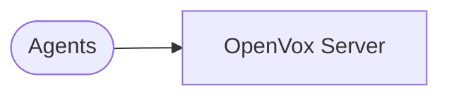
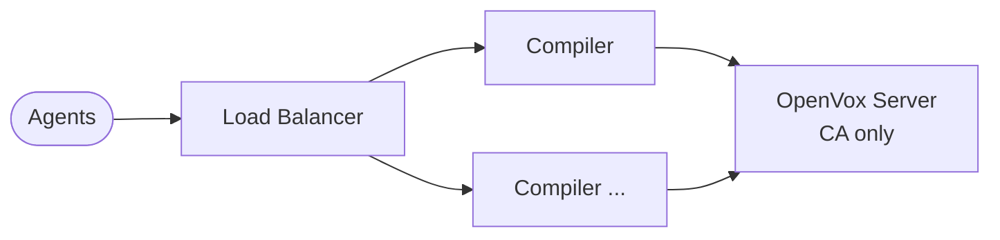
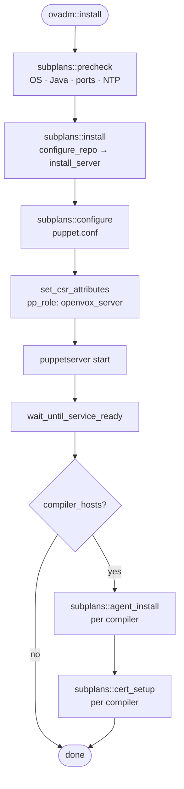

# ovadm architecture

## Supported topologies

### Standard

A single OpenVox Server node acting as CA, catalog compiler, and file server.

### Large

An OpenVox Server (CA only) backed by a pool of compilers that handle catalog compilation. A load balancer distributes agent traffic across the compiler pool.

## Plan and task structure

Plans are thin orchestrators — they call subplans and tasks in sequence, handle errors, and produce user-facing output. Subplans cover one phase of an operation. Tasks are atomic shell operations that output structured JSON.

## Certificate role extensions

ovadm embeds a `pp_role` trusted certificate extension in every infrastructure node's certificate at issuance time:

| Node type | `pp_role` value |
| --------- | --------------- |
| OpenVox Server | `openvox_server` |
| Compiler | `openvox_compiler` |

This is implemented via `csr_attributes.yaml` written before the node's first agent run (or before puppetserver's first start on the server). After signing, `$trusted['extensions']['pp_role']` is available in Puppet code for role-based classification without a node classifier.

## Key differences from peadm

| Concern | peadm (Puppet Enterprise) | ovadm (OpenVox) |
| ------- | ------------------------- | --------------- |
| Installation | Tarball installer | OS packages via apt/yum |
| Java | Bundled | Installed as a package dependency |
| HA replica | Supported | Not supported (PE-only feature) |
| Console / RBAC | Required | Not present |
| Node classification | Node groups (Console) | `$trusted['extensions']['pp_role']` cert extension |
| Service name | `pe-puppetserver` | `puppetserver` |
| Config paths | `/etc/puppetlabs/` | `/etc/puppetlabs/` (identical) |

See [`plan.md`](plan.md) for the full task catalog and implementation roadmap.
