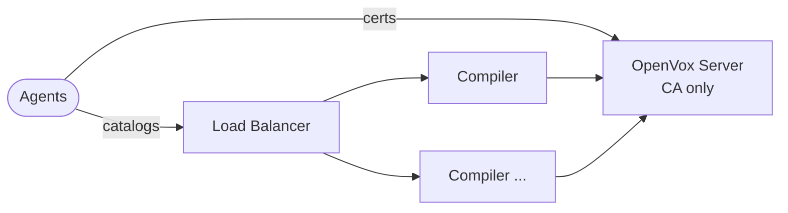
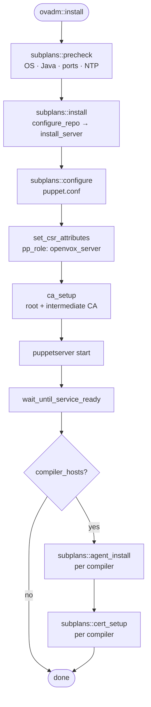

# ovadm architecture

## Supported topologies

### Standard

A single OpenVox Server node acting as CA, catalog compiler, and file server.

```mermaid
flowchart LR
    agents([Agents]) --> server[OpenVox Server]
```

### Large

An OpenVox Server (CA only) backed by a pool of compilers that handle catalog compilation. A load balancer distributes catalog requests across the compiler pool; agents contact the server directly for certificate operations.

```mermaid
flowchart LR
    agents([Agents]) -->|catalogs| lb[Load Balancer]
    agents -->|certs| server[OpenVox Server\nCA only]
    lb --> c1[Compiler]
    lb --> c2[Compiler ...]
    c1 --> server
    c2 --> server
```

## Plan and task structure

Plans are thin orchestrators — they call subplans and tasks in sequence, handle errors, and produce user-facing output. Subplans cover one phase of an operation. Tasks are atomic shell operations that output structured JSON.

```mermaid
flowchart TD
    install([ovadm::install]) --> precheck[subplans::precheck\nOS · Java · ports · NTP]
    precheck --> installsp[subplans::install\nconfigure_repo → install_server]
    installsp --> configure[subplans::configure\npuppet.conf]
    configure --> csr[set_csr_attributes\npp_role: openvox_server]
    csr --> casetup[ca_setup\nroot + intermediate CA]
    casetup --> start[puppetserver start]
    start --> wait[wait_until_service_ready]
    wait --> large{compiler_hosts?}
    large -- no --> done([done])
    large -- yes --> agent_install[subplans::agent_install\nper compiler]
    agent_install --> cert_setup[subplans::cert_setup\nper compiler]
    cert_setup --> done
```

## Certificate role extensions

ovadm embeds a `pp_role` trusted certificate extension in every infrastructure node's certificate at issuance time:

| Node type | `pp_role` value |
| --------- | --------------- |
| OpenVox Server | `openvox_server` |
| Compiler | `openvox_compiler` |

This is implemented via `csr_attributes.yaml` written before the node's first agent run (or, on the server, before `ovadm::ca_setup` issues its certificate). After signing, `$trusted['extensions']['pp_role']` is available in Puppet code for role-based classification without a node classifier.

## Certificate authority

The server's CA is created by `puppetserver ca setup` before the service first starts, the way the Puppet Enterprise installer does it: a root certificate, an intermediate signing certificate, and the server's own certificate issued from the intermediate, all valid for 15 years. Left to itself, puppetserver would generate a single self-signed CA on first start whose lifetime is `ca_ttl` — five years by default, expiring together with the first agent certificates it signed. `ca_setup` is skipped when a CA already exists, so reruns and upgrades never disturb one. See [install.md](install.md#the-ca) for how to tell the two layouts apart.

## Key differences from peadm

| Concern | peadm (Puppet Enterprise) | ovadm (OpenVox) |
| ------- | ------------------------- | --------------- |
| Installation | Tarball installer | OS packages via apt/yum |
| Java | Bundled | Installed as a package dependency |
| HA replica | Supported | Not supported (PE-only feature) |
| Console / RBAC | Required | Not present |
| Node classification | Node groups (Console) | `$trusted['extensions']['pp_role']` cert extension |
| Service name | `pe-puppetserver` | `puppetserver` |
| Config paths | `/etc/puppetlabs/` | `/etc/puppetlabs/` (identical) |

See [`plan.md`](plan.md) for the full task catalog and implementation roadmap.
